# XI Model Viewer

A FFXI asset browser — **zones, NPCs & monsters, playable characters, spell
effects, textures, music, sound effects and raw DAT data** — with a **WebGL2**
viewport, wrapped in a **Tauri 2** shell (~7 MB standalone exe, no Electron). Skinning runs on the GPU: the vertex
shader rotates pre-weighted joint-local positions by per-joint pose quaternions;
the CPU only evaluates the skeleton pose (one quat/trans/scale triplet per joint
per frame).

## Download

Get the latest release by going to: [Github Releases](https://github.com/vekien/xi-model-viewer/releases)

The app checks for a newer release in the background on start — nothing waits on
it, and if one is out you get a notice with a link to it. **OK** dismisses that
notice until the next release.

## Features

- **Zones** — full zone geometry with day/night time-of-day and weather
  (auroras, fog, rain, …), adjustable brightness and scene background, a
  searchable object/placement browser, and zone BGM + ambient sound effects.
- **NPCs & monsters** — a categorised tree of every entity model. Play any of
  its animations or schedules, scrub the timeline frame-by-frame, set playback
  speed (10–200 %), and inspect the bone hierarchy in a skeleton overlay.
- **Characters** — compose a PC from race, face, weapons and gear. Gear is
  grouped by set (Artifact / Relic / Empyrean / Ebur / Furia / Ebon) and sorted
  A–Z; equipped weapons play their weapon-skill animations; the 40-character
  look string is generated and copyable.
- **Effects** — search and play any standalone spell/ability VFX (magic, job
  abilities, summons, weapon skills) on an empty stage, with schedule picker,
  playback speed and the effect's own sound.
- **Images** — browse every UI, map and cutscene texture DAT with a filter,
  per-set list and zoom.
- **Music & Sound FX** — play any BGW/SPW track (vgmstream-decoded) with a live
  waveform visualiser, seek bar and loop info.
- **Data** — a DAT inspector: walks any DAT's section tree (folders, resource
  types, header peeks like texture size/format, joint counts, sound ids) without
  dumping payloads; textures open in a viewer on click. FTABLE/VTABLE pairs
  render as a searchable file-id → DAT table whose rows jump straight to the
  named DAT's structure, with gear model ids browsable per race/slot and
  monster/NPC model ids resolved from the same tables.
- **Zone actors** — place NPCs, composed characters and light sources on any
  zone's terrain (click to place with a ground line-trace), then select them in
  the viewport and move / rotate / scale with a gizmo (keys 1 / 2 / 3, Esc to
  drop the selection, F to frame). Each actor plays its own motion, schedule or
  borrowed pack, casts and receives the sun shadows, and duplicates with
  Ctrl+C / Ctrl+V. Point, spot and ambient lights take colour or temperature,
  intensity and radius and light the terrain, props and actors around them.
  Whole arrangements save and load as named actor sets.
- **Database** — the client's record DATs as searchable, sortable tables: items
  (with decoded stats, jobs, slots, icons), quests, missions, key items,
  titles, spells, abilities and the other d_msg string tables, in English or
  Japanese. Advanced filters (rule builder or an SQL-ish query string such as
  `str > 20 and int > 20`), CSV / JSON export, and a one-click `xi mv database`
  bake so the tables load instantly instead of parsing 20 MB DATs.
- **Camera** — WASD fly camera with roll (Alt+Q / Alt+E), fly speed in steps
  of 5, a render-distance slider, and a keyframe Camera Sequencer with a spline
  path, linear-rotation option and time-of-day / weather tracks.
- **Throughout** — type-to-filter dropdowns, arrow-key list navigation,
  reveal-any-DAT in the system file manager, wireframe / unlit / collision /
  navmesh / skybox overlays, and glTF/FBX model export (via the xi-tools CLI).

## Screenshots

Place NPCs, characters and lights in a zone and light the scene at dusk:

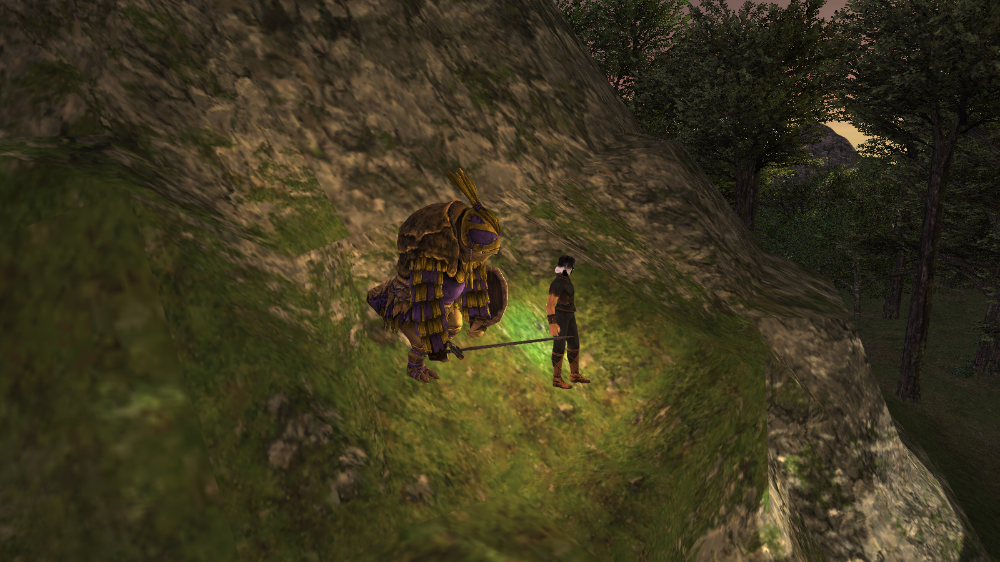

Zones render with weather and time-of-day; the object browser lists every placement:

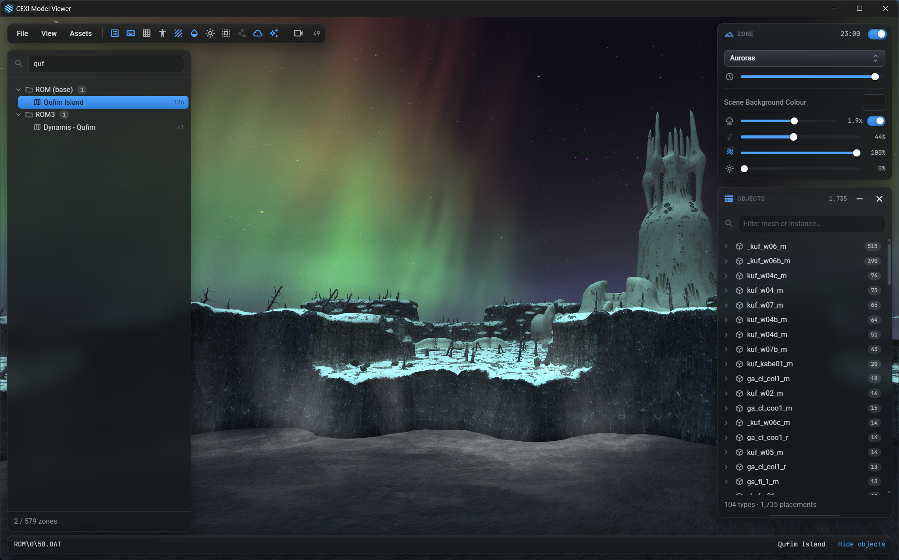


NPCs and monsters play their animations, with a frame scrubber and speed control:

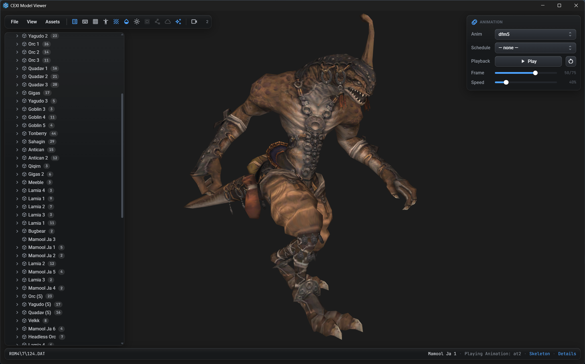

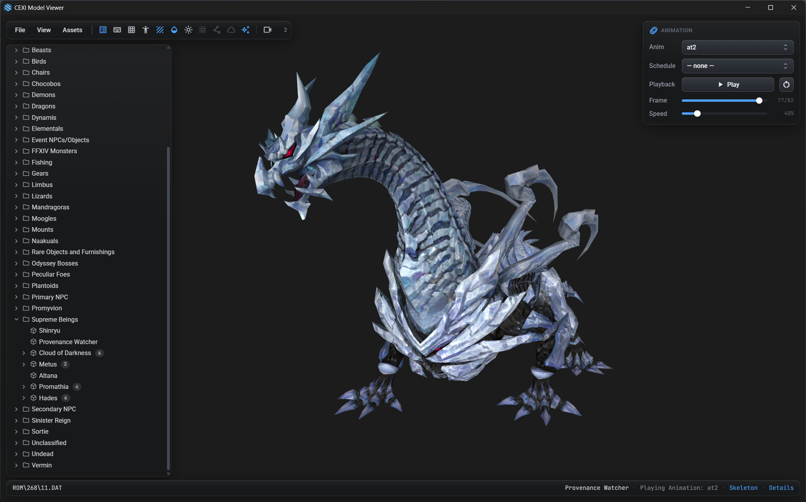

Compose a character from gear and weapons, and preview weapon-skill animations:

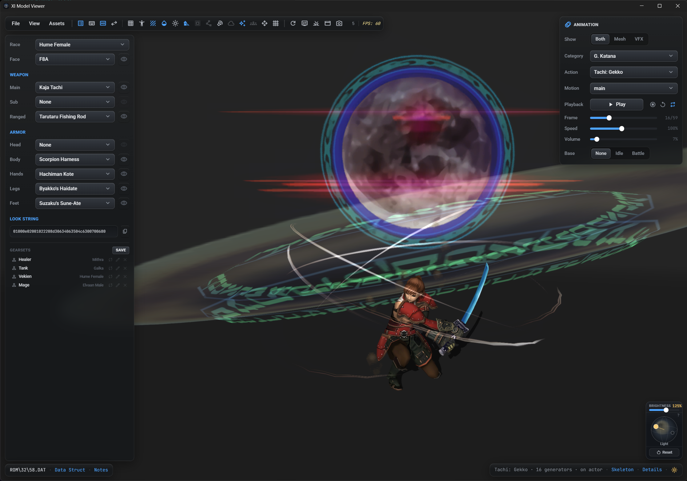

Browse textures, and play music / sound effects with a waveform visualiser:

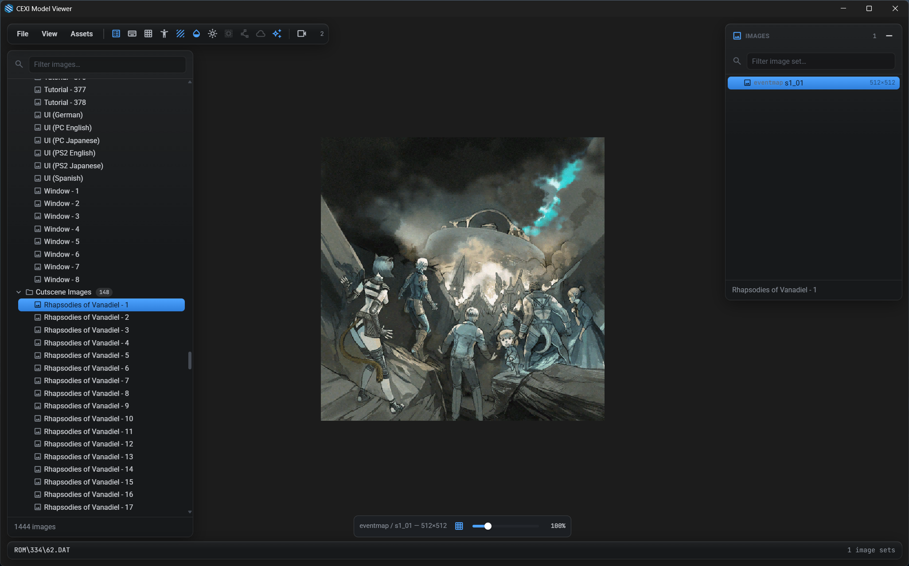

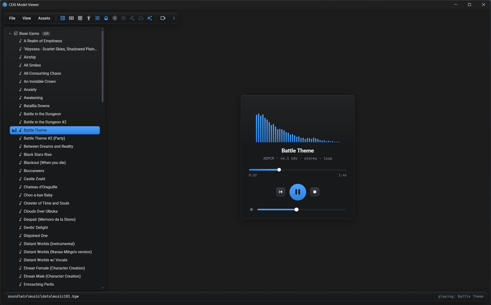

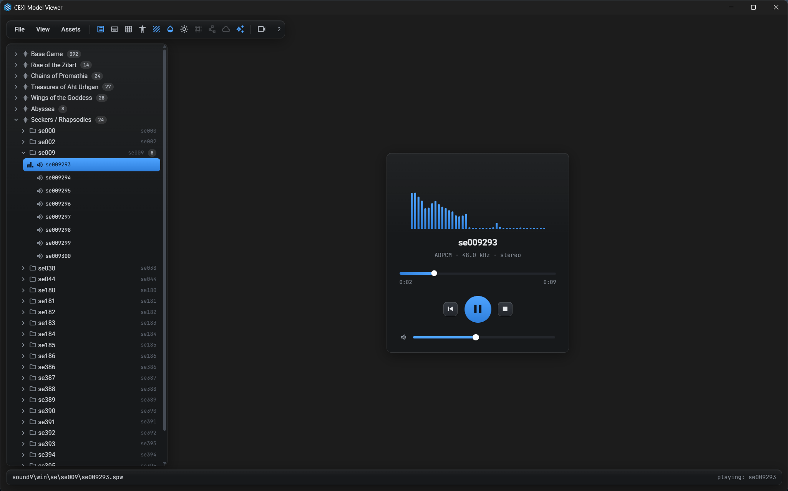

Play any spell or ability effect on its own stage:

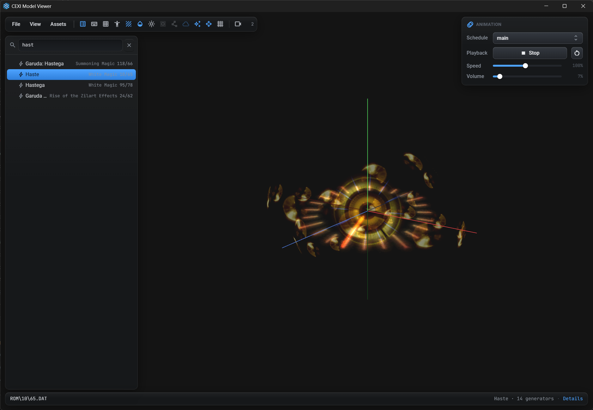

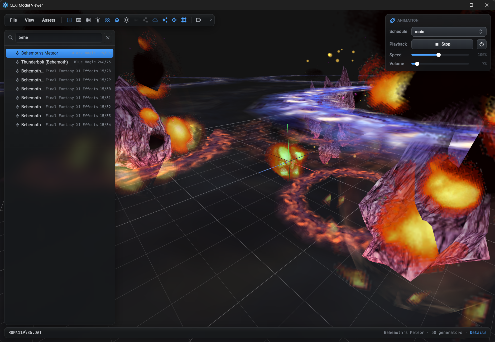

Inspect any DAT's structure — folders, sections and what lives in each — and
browse the FTABLE/VTABLE file-id → DAT mapping:

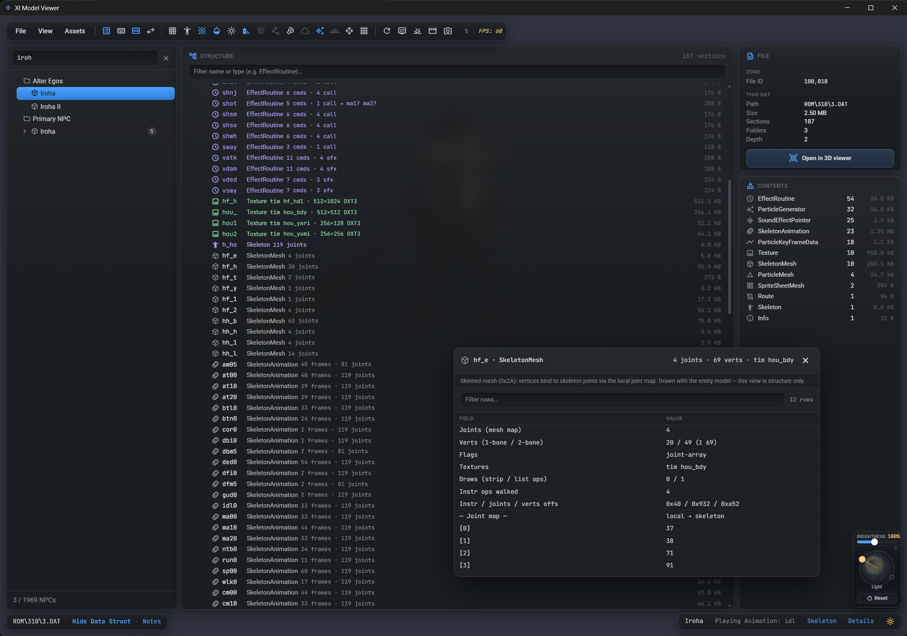

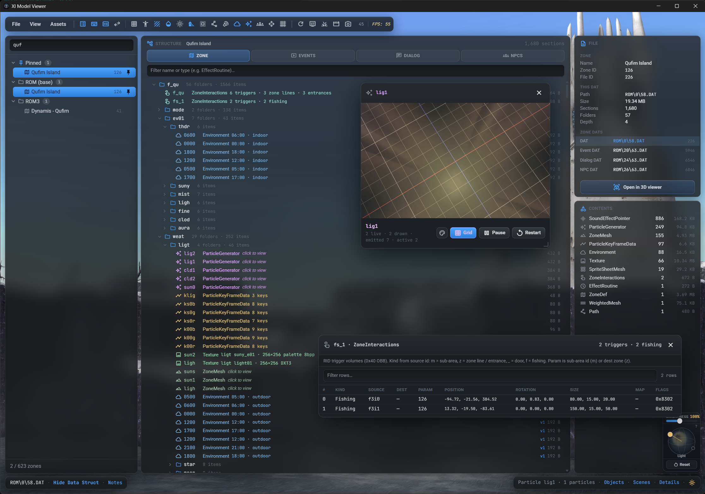

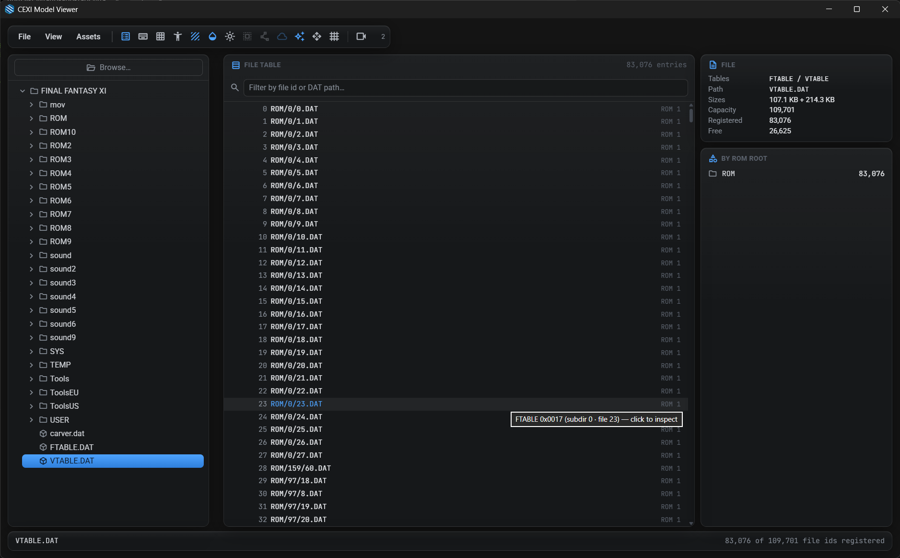

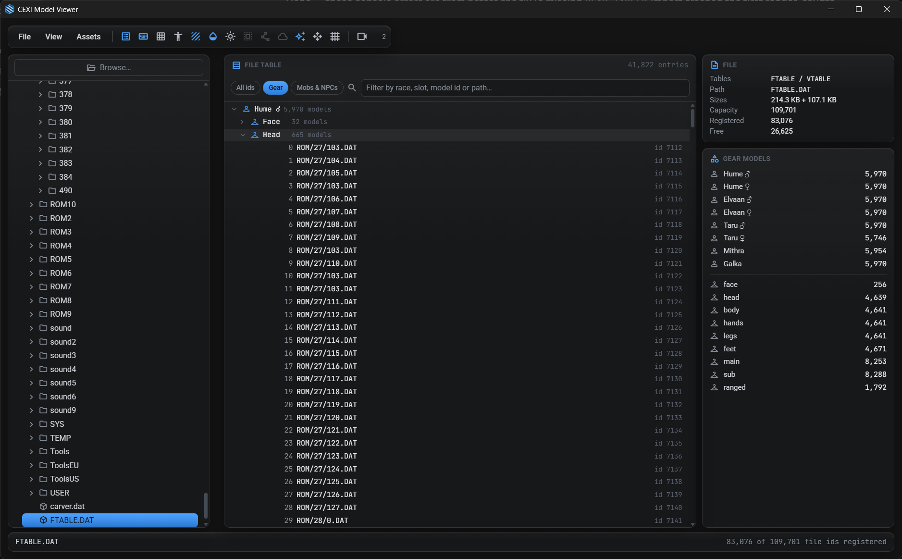

---

## Setup

| Path | Purpose |
|---|---|
| `ui/` | Frontend, built by Vite. `ui/js/` is the engine as vanilla ES modules — `dat.js` (DAT section walker + skeleton/mesh/texture/animation parsers), `pose.js` (pose evaluation), `renderer.js` (WebGL2, GPU skinning, DXT via `WEBGL_compressed_texture_s3tc` + CPU fallback), `camera.js`, `backend.js`, `launch.js` (CLI / query-string launch options), audio/particle helpers. `ui/src/` is the React UI (viewport, panels, asset lists). |
| `src-tauri/` | Rust shell. IPC commands for filesystem access (`list_dir`, `read_file`, `write_file`), native pickers, audio decode (`decode_vgmstream`), model export (`xi_mesh_export`), and reveal-in-file-manager (`reveal_path`). |
| `scripts/serve.py` | Dev server: serves `ui/` plus `/fs` endpoints so the frontend runs in a plain browser without Tauri (`backend.js` falls back automatically). |
| `ui/public/lists/` | Baked asset lists (races, gear, NPCs, music, SFX, effects, images). Regenerated by `xi mv update` in xi-tools — not by anything in this repo. |

## Build & run

Requires Rust (no Node needed):

```
Start.bat          (Windows)
./start.sh         (macOS / Linux)
```

Release build (embeds the Vite frontend, standalone binary):

```
Build.bat          (Windows)
./build.sh         (macOS / Linux — pass --bundle for a .dmg/.AppImage)
```

or:

```
cd src-tauri
cargo run
```

Release exe: `cargo build --release` → `src-tauri/target/release/xi-model-viewer.exe`
(frontend assets are embedded; the exe is standalone, needing only the WebView2
runtime that ships with Windows 11).

Browser dev mode (no Rust):

```
python scripts/serve.py
```

then open http://localhost:8766. `window.xi` exposes the renderer for
debugging.

## Zone preview launch

Another tool — a zone editor's *Preview* button, a shortcut, a shell — can start
the viewer straight on a zone, with none of the app around it:

```
xi-model-viewer.exe --zone "ROM/171/34.DAT"
```

That opens the zone alone: the viewport plus the Zone panel (weather, time of
day, fog, brightness, scene background, zone BGM and ambient volume). No menu
bar, no asset panel, no status bars, no object browser. Fly controls (WASD /
QE / Shift boost, wheel for speed) work as they do in the app, `F` re-frames the
zone, and the window title becomes the zone name. A preview is a side trip — it doesn't overwrite the session the full app
restores on its next normal launch.

| Option | Meaning |
|---|---|
| `--zone <dat\|id>` | Zone to open: `ROM/171/34.DAT`, a leveleditor `game/ROM/…` path, the DAT's absolute path, or a zone id (`--zone 200`). |
| `--minimal` | Chrome-free viewer. The default whenever `--zone` is given. |
| `--full-ui` | Open the same zone in the whole app instead. |
| `--weather <id>` | Starting weather — `fine`, `rain`, `snow`, `aura`, … Ignored (with a console warning) if the zone doesn't have it. |
| `--time <t>` | Starting time of day, `HH:MM` or minutes past midnight. |
| `--clock` | Run the day clock — a full FFXI day per real minute. |

`--zone` is resolved against the configured game path (and the HD path, when HD
is on), so an absolute DAT path from either install works. If the game path
hasn't been set yet, the preview window asks for it and then opens the zone.

Browser dev mode takes the same options as a query string, which is the quickest
way to try one out:

```
http://localhost:5173/?zone=ROM/171/34.DAT&time=18:00&weather=rain
```

(`ui=full` is the query-string spelling of `--full-ui`.)

## Environment variables

Machine-specific paths default to the original hardcoded Windows values; set the
matching variable to override one. Unset or blank means "use the default".

Copy `.env.example` to `.env` (git-ignored) to set them persistently:

```
cp .env.example .env
```

The repo-root `.env` is read by `start.sh`, `build.sh`, the Tauri app itself,
`scripts/serve.py` and `vite.config.js` — so it applies however the app is launched.
A real environment variable always beats the file, so one-offs still work:
`XI_GAME_DIR="$HOME/FFXI" ./start.sh`. `XI_ENV_FILE` points at a different
file; the app also falls back to a `.env` next to the binary (Finder / shortcut
launches, where the working directory isn't the repo).

| Variable | Overrides | Default |
|---|---|---|
| `XI_GAME_DIR` | FFXI install dir | `C:\Program Files (x86)\PlayOnline\SquareEnix\FINAL FANTASY XI` |
| `XI_VGMSTREAM` | `vgmstream-cli` (BGW/SPW audio decode) | co-located `vgmstream/` → embedded copy (Windows) → PATH |
| `XI_CLI` | xi-tools **folder** (or `xi.exe`); needs **Python 3.14** + venv | Settings → PATH → `~/.local/bin/xi` |
| `XI_CACHE_DIR` | where the embedded vgmstream is unpacked | `%LOCALAPPDATA%` → `$XDG_CACHE_HOME` → `~/.cache` → temp, all `+ /XiModelViewer/vgmstream` |
| `XI_DEV_HOST` / `XI_DEV_PORT` | `scripts/serve.py` bind address / port (a port argv still wins) | `127.0.0.1` / `8766` |
| `XI_FS_PROXY` | where Vite proxies `/fs` in browser dev mode | `http://127.0.0.1:8766` |
| `XI_DATA_DIR` | where the app keeps its own data (xi-tools checkout, caches) | `%LOCALAPPDATA%`/`~/.local/share` `+ /XiModelViewer` |
| `XI_TOOLS_DIR` | an existing xi-tools checkout to use instead of the managed one | managed clone under `XI_DATA_DIR` |
| `XI_ENV_FILE` | which `.env` file to read | repo-root `.env`, then a `.env` beside the binary |

```
XI_GAME_DIR="$HOME/FFXI" ./start.sh
```

Note: `XI_GAME_DIR` supplies the *default* only. A game path already saved in
Settings (`localStorage.gamePath`) still wins — clear it to pick the env value
back up.
