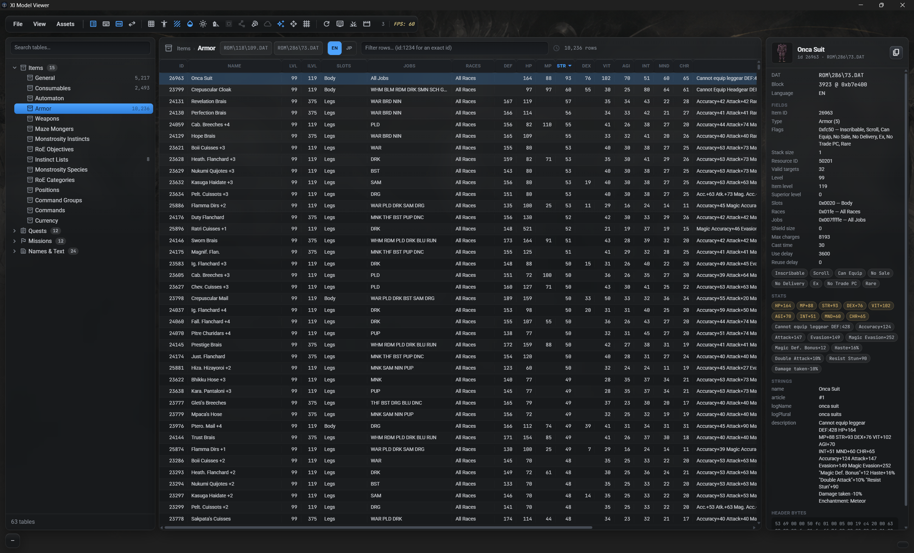

# XI Model Viewer

A FFXI asset browser — **zones, NPCs & monsters, playable characters, spell
effects, textures, music, sound effects and raw DAT data** — in a **WebGL2**
viewport.

- One standalone ~38 MB exe. **Tauri 2**, not Electron.
- Embeds vgmstream, the baked asset lists and the viewport backgrounds — nothing to install.
- Skinning runs on the GPU: the vertex shader rotates pre-weighted joint-local
  positions by per-joint pose quaternions, so the CPU only evaluates the skeleton
  pose (one quat/trans/scale triplet per joint per frame).

## Download

Get the latest release by going to: [Github Releases](https://github.com/vekien/xi-model-viewer/releases)

The app checks for a newer release in the background on start — nothing waits on
it, and if one is out you get a notice with a link to it. **OK** dismisses that
notice until the next release.

### Linux

Two packages, self-contained in the same sense the .exe is — the frontend, the
baked lists and the backgrounds live inside the binary either way. Pick by
distro, not by preference:

```
sudo apt install ./xi-model-viewer_<version>_amd64.deb    # Ubuntu, Mint, Pop!_OS, Debian
chmod +x xi-model-viewer_<version>_amd64.AppImage         # everything else, Manjaro included
./xi-model-viewer_<version>_amd64.AppImage
```

The **.deb** is the small one (~20 MB) because it leaves webkit2gtk and gtk3 to
the distro — which is also why it needs a distro that has them: Ubuntu 22.04 and
Mint 21 onwards do. It installs `/usr/bin/xi-model-viewer` and adds the app to
your menu. Install it with `apt`, not `dpkg -i`, so those two get pulled in.

The **AppImage** carries that stack itself, which is what lets it run on Arch and
Manjaro and what makes it ~95 MB. Nothing is installed; delete the file to
uninstall. It mounts itself with FUSE 2, which Ubuntu and Mint stopped shipping
by default:

```
sudo apt install libfuse2      # Ubuntu 22.04, Mint 21
sudo apt install libfuse2t64   # Ubuntu 24.04, Mint 22
```

or sidestep FUSE altogether with `APPIMAGE_EXTRACT_AND_RUN=1 ./xi-model-viewer_*.AppImage`.

Both are built on Ubuntu 22.04 against glibc 2.35, and glibc only promises
compatibility forwards, so they run on 22.04 and anything newer. Audio is the one
thing that is not in the box: the vgmstream baked into the Windows build is a
win32 one, so `.bgw`/`.spw` playback looks for a `vgmstream-cli` on `PATH`
instead (`pacman -S vgmstream`, or build it) — everything else works without it.

## Features

### Zones

- Load any zone with its full geometry, textures and collision.
- Time of day and weather — rain, snow, fog, auroras — with a cross-faded transition.
- Zone BGM and ambient sound effects play with it; adjustable brightness and scene background.
- Object browser groups every placement by kind (sky, water, collision, sub-areas, unplaced), with per-object and per-group visibility, plus the zone's VFX and sound groups.
- **Live Selection** — click an object in the world, drag it on an XYZ gizmo, undo.
- **Region Culling** — draw only what the zone's own PVS regions say is visible.
- **Enable LOD** — draw objects at the detail level the zone actually placed them at.
- **Toggle NPCs** — stand the server's NPC placements (from CatsEyeXI's `npc_list`) on the zone, each at its position and heading, wearing its look.

### NPCs & monsters

- Categorised tree of every entity model in the client.
- One **Motion** picker covers animations, schedules and the skill packs a trust borrows.
- Scrub the timeline frame by frame; playback speed 10–200 %.
- Play the entity's own VFX routines, with their own volume.
- Inspect the bone hierarchy in a skeleton overlay.
- **Base** (Idle / Battle) lays a clip over a resting pose — blend in, play, blend back.

### Characters

- Compose a PC from race, face, gear and weapons.
- Gear grouped by set — Artifact, Relic, Empyrean, Ebur · Furia · Ebon, Abjuration, Mythic, Aeonic, Prime.
- Equipped weapons play their weapon-skill animations; ranged weapons stay stowed until the action draws them.
- Battle stances named per race, read from each weapon DAT's own animation type.
- The 40-character look string is generated and copyable.
- **(WIP) Character Creation** — the character-creation screen's high-poly models: 8 faces per race, A/B texture variants, with or without initial equipment.

### Effects

- Search and play any spell or ability VFX — magic, job abilities, summons, weapon skills.
- Play it on an empty stage, or on a loaded character or NPC, attached to the joints the DAT names.
- The caster's own cast animation plays with it, on the effect's clock.
- Play / Pause / Rewind / Loop transport, playback speed, and the effect's sound.

### Camera & sequencer

- WASD fly camera with roll (Alt+Q / Alt+E), fly speed in steps of 5, render-distance slider.
- **View › Toggle Orthographic** — orthographic projection, for flat elevation and isometric views with no perspective. Orbit, pan, zoom and WASD all keep working; in ortho W/S zoom, since a dolly along the view axis draws the same picture.
- Multi-track keyframe timeline: camera position, camera rotation, weather, time of day.
- Spline or linear paths, with eased timing through keys so shots don't change pace at a keyframe.
- **Curve rows** — click a camera lane to graph its channels underneath it.
- **Lock to Actor** keeps a moving subject framed by tracking the pelvis.
- **Actor tracks** — record where an actor stands and which motion it plays, so a take can walk it across the zone and switch it from walk to idle on cue.
- Effects and sound play back with the take; sequences save by name.

### Scenes

- Named casts of actors on a zone — open one and its whole cast appears.
- Place NPCs, composed characters and lights on the terrain with a click-to-place ground trace.
- Move / rotate / scale gizmo (1 / 2 / 3, Esc to deselect, F to frame), Ctrl+C / Ctrl+V to duplicate.
- Each actor runs its own motion, schedule, effect routines and frame scrubber, and casts sun shadows.
- Point, spot and ambient lights take colour or temperature, intensity and radius.

### Database

- The client's record DATs as searchable, sortable tables: items (decoded stats, jobs, slots, icons), quests, missions, key items, titles, spells, abilities and the other d_msg string tables.
- English or Japanese.
- Advanced filters — a rule builder, or an SQL-ish query string such as `str > 20 and int > 20`.
- CSV / JSON export.
- One-click `xi mv database` bake so tables load instantly instead of parsing 20 MB DATs.
- **File → Database Manager** updates, imports and exports the baked tables.

### Data — the DAT inspector

- Walk any DAT's section tree: folders, resource types, header peeks (texture size and format, joint counts, sound ids) — no payload dumps. Textures open in a viewer on click.
- FTABLE/VTABLE pairs render as a searchable file-id → DAT table whose rows jump to the named DAT.
- Gear model ids browsable per race and slot; monster and NPC model ids resolved from the same tables.
- Bump maps preview as normal maps; routes open as keyframe tables.
- XISTRING menu strings and `USER\` macro books get real layouts; spell and ability tables open in a draggable inspector.
- Environment, ZoneInteractions and a ZoneMesh preview cover the zone-side records.
- **Notes** — free text on any DAT, kept in a plain, editable `%LOCALAPPDATA%\XiModelViewer\notes.json`, shown as a tooltip in the file tree.

### Title UI editing

- Inspect UiMenu (0x30) windows and UiElementGroup (0x31) sets as tables.
- Patch position, size and nav, and **save back to the DAT** through the xi-tools CLI.
- Writes land in the right root (pivot / HD / game), resolved per DAT.

### Images

- Browse every UI, map and cutscene texture DAT, with a filter, per-set list, zoom and pan.
- **Sprite panel** lists every sprite in a title/lobby layout, filtered to the selected atlas.

### Music & Sound FX

- Play any BGW/SPW track, decoded by an embedded vgmstream.
- Live waveform visualiser, seek bar and loop info.

### Export

- glTF / FBX model export via the xi-tools CLI, with a part picker and Mesh / Animation tabs.
- **Batch Export** for models, animations and zones, plus **Music** and **Sound FX** tabs that decode straight to `.wav` in-app — no xi-tools needed, just the game path.
- Sounds export under their own game folder, so same-numbered tracks from different expansions don't collide; filenames can be the real track name or the game's.
- A banner reports what was written and where, with a button to open the folder.

### Viewport

- Background images, a flat floor with a colour picker, floor repeat and a radial edge fade.
- Trackball gizmo aims the sun that casts the model's shadow.
- Overlays: wireframe, unlit, skeleton, collision, navmesh, skybox, sound markers, axes, grid.
- HD and PIVOT DAT roots toggle live.
- Shadow, render and effects distance, field of view, FPS limit and render resolution.

### Throughout

- Type-to-filter dropdowns and search on every asset list, with arrow-key navigation.
- Pin favourites in the zone, NPC, character and DAT lists.
- Reveal any DAT in the system file manager.
- Built-in colour picker with a working desktop eyedropper and a magnified loupe.
- `--zone` opens a single zone chrome-free, for another tool's Preview button — see [Zone preview launch](#zone-preview-launch).

## Screenshots

Place NPCs, characters and lights in a zone and light the scene at dusk:


Zones render with weather and time-of-day; the object browser lists every placement:


NPCs and monsters play their animations, with a frame scrubber and speed control:


Compose a character from gear and weapons, and preview weapon-skill animations:


Browse textures, and play music / sound effects with a waveform visualiser:


Play any spell or ability effect on its own stage:


Inspect any DAT's structure — folders, sections and what lives in each — and
browse the FTABLE/VTABLE file-id → DAT mapping:


Browse the client's record DATs as tables — items with decoded stats, jobs and
icons, quests, missions and the string tables — with filters and CSV / JSON export:



---

## Setup

| Path | Purpose |
|---|---|
| `ui/` | Frontend, built by Vite. `ui/js/` is the engine as vanilla ES modules — `dat.js` (DAT section walker + skeleton/mesh/texture/animation parsers), `pose.js` (pose evaluation), `renderer.js` (WebGL2, GPU skinning, DXT via `WEBGL_compressed_texture_s3tc` + CPU fallback), `camera.js`, `backend.js`, `launch.js` (CLI / query-string launch options), audio/particle helpers. `ui/src/` is the React UI (viewport, panels, asset lists). |
| `src-tauri/` | Rust shell. IPC commands for filesystem access (`list_dir`, `read_file`, `write_file`), native pickers, audio decode (`decode_vgmstream`), model export (`xi_mesh_export`), and reveal-in-file-manager (`reveal_path`). |
| `scripts/serve.py` | Dev server: serves `ui/` plus `/fs` endpoints so the frontend runs in a plain browser without Tauri (`backend.js` falls back automatically). |
| `ui/public/lists/` | Baked asset lists (races, gear, NPCs, music, SFX, effects, images). Regenerated by `xi mv update` in xi-tools — not by anything in this repo — except `zone_npcs.json`, the server's NPC placements per zone, baked from CatsEyeXI's `sql/npc_list.sql` by `scripts/gen_zone_npcs.py` (needs `XI_GAME_DIR` for the file tables). `manifest.json` is xi-tools' index of the set by sha256, copied here with them; it is how the app refreshes these lists at runtime (see [Updating the lists](#updating-the-lists)). |

## Build & run

Requires Rust (no Node needed):

```
Start.bat          (Windows)
./start.sh         (macOS / Linux)
```

Release build (embeds the Vite frontend, standalone binary):

```
Build.bat          (Windows)
./build.sh         (macOS / Linux — pass --bundle for a .deb + .AppImage, or a .dmg)
```

or:

```
cd src-tauri
cargo run
```

Release exe: `cargo build --release` → `src-tauri/target/release/xi-model-viewer.exe`
(frontend assets are embedded; the exe is standalone, needing only the WebView2
runtime that ships with Windows 11).

### Linux packages

`.github/workflows/xi-model-viewer-linux.yml` builds both Linux packages on
Ubuntu 22.04 — the oldest release the app supports — then installs each one in a
container for Ubuntu 22.04, Ubuntu 24.04, Mint 21, Mint 22 and Manjaro and
launches it on a virtual display. The .deb goes in through `apt`, so its declared
dependencies have to genuinely resolve on that distro rather than being papered
over by `dpkg -i`. Every run uploads a screenshot per distro, which is the
evidence that the package *works* rather than merely builds.

The launch check is `scripts/linux_smoke_test.sh`, and it runs anywhere:

```
scripts/linux_smoke_test.sh src-tauri/target/release/xi-model-viewer --screenshot shot.png
```

It waits for a window titled *XI Model Viewer* **and** for the app to create its
data directory. The second half is the point: that directory is created by the
`lists_update` command, which only runs because React mounted inside the WebView
and called it — so watching it appear proves the whole stack came up, where "the
process is still running" would pass a build whose WebView never painted.

Browser dev mode (no Rust):

```
python scripts/serve.py
```

then open http://localhost:8766. `window.xi` exposes the renderer for
debugging.

### Testing the first-run experience

Setup happens once, so the flow a new user meets is the one you stop seeing the
day you finish setting up. `Reset.bat` puts it back (Windows):

```
Reset.bat            park everything the viewer remembers
Reset.bat /restore   put the most recent backup of each back
```

It renames both places the viewer stores anything aside as
`<name>.bak-<timestamp>` — the WebView2 profile holding every setting, saved
scene and path, and `%LOCALAPPDATA%\XiModelViewer\` holding the xi-tools
install, vgmstream, downloaded lists, the imported database and `notes.json`. The
next launch is then a genuine first run. Nothing is deleted, and a local xi-tools
checkout is left alone — only the pointer to it is parked, so the viewer forgets
it, and its `.env` is shared with other apps.

Close the viewer first: it writes its settings back out on exit.

## Updating the lists

The asset lists under `ui/public/lists/` are baked into the executable, but this
repo does not author them — [xi-tools](https://github.com/vekien/xi-tools) does,
with `xi mv update`, which writes a `manifest.json` of sha256s beside them at the
end of every run. Push that from xi-tools and every viewer picks it up: on boot
the app fetches the manifest from `xi-tools/main/mv/lists`, replaces any list
whose contents no longer match the copy it holds — into
`%LOCALAPPDATA%\XiModelViewer\lists`, which it reads in preference to its baked
copy — and shows a banner naming what changed, with a Reload button.

There is nothing to run here, and no version to keep in step: the comparison is
by file hash, so a list reverted in xi-tools goes back to matching on its own and
a download that gets corrupted is simply re-fetched. Every download is verified
against the manifest's sha256 and size and written through a `.part` file, so a
failure leaves the previous copy intact. Offline, the baked lists are used
exactly as before.

What the app does on boot, in order:

1. The baked lists under `ui/public/lists/` load — the app is usable immediately.
2. It asks xi-tools for the manifest, with a **10 second** cap. A timeout, a
   proxy or no network at all is swallowed silently; the baked lists stand.
3. Anything whose contents have moved is downloaded and verified.
4. The banner appears.

The session stays on whatever it started with, deliberately: a download landing
mid-boot does not change what this session reads, so two panels opened seconds
apart can never disagree. Reloading is what switches over, which is what the
banner's button does.

`ui/public/lists/` is a copy of xi-tools' `mv/lists/`, manifest included. The
release workflow refreshes it from xi-tools' `main` before building, so a
released .exe is baked with whatever was current at build time and a fresh
install is already up to date on first launch — the copy committed here is the
fallback if that fetch fails, and what dev mode serves. A manifest that disagrees
with the files it arrived with fails the build. `zone_npcs.json` is the
exception to xi-tools' ownership: it is generated *here* by
`scripts/gen_zone_npcs.py`, so it only reaches users once it has also been
copied into xi-tools' `mv/lists/`.

To try an update before pushing it, serve a copy of the lists locally and point
the dev server at it with `XI_LISTS_RAW` (dev server only — the app always reads
xi-tools' `main`).

## Zone preview launch

Another tool — a zone editor's *Preview* button, a shortcut, a shell — can start
the viewer straight on a zone, with none of the app around it:

```
xi-model-viewer.exe --zone "ROM/171/34.DAT"
```

That opens the zone alone: the viewport plus the Zone panel (weather, time of
day, fog, brightness, scene background, zone BGM and ambient volume). No menu
bar, no asset panel, no status bars, no object browser. Fly controls (WASD /
QE / Shift boost, wheel for speed) work as they do in the app, `F` re-frames the
zone, and the window title becomes the zone name. A preview is a side trip — it doesn't overwrite the session the full app
restores on its next normal launch.

| Option | Meaning |
|---|---|
| `--zone <dat\|id>` | Zone to open: `ROM/171/34.DAT`, a leveleditor `game/ROM/…` path, the DAT's absolute path, or a zone id (`--zone 200`). |
| `--minimal` | Chrome-free viewer. The default whenever `--zone` is given. |
| `--full-ui` | Open the same zone in the whole app instead. |
| `--weather <id>` | Starting weather — `fine`, `rain`, `snow`, `aura`, … Ignored (with a console warning) if the zone doesn't have it. |
| `--time <t>` | Starting time of day, `HH:MM` or minutes past midnight. |
| `--clock` | Run the day clock — a full FFXI day per real minute. |

`--zone` is resolved against the configured game path (and the HD path, when HD
is on), so an absolute DAT path from either install works. If the game path
hasn't been set yet, the preview window asks for it and then opens the zone.

Browser dev mode takes the same options as a query string, which is the quickest
way to try one out:

```
http://localhost:5173/?zone=ROM/171/34.DAT&time=18:00&weather=rain
```

(`ui=full` is the query-string spelling of `--full-ui`.)

## Environment variables

Machine-specific paths default to the original hardcoded Windows values; set the
matching variable to override one. Unset or blank means "use the default".

Copy `.env.example` to `.env` (git-ignored) to set them persistently:

```
cp .env.example .env
```

The repo-root `.env` is read by `start.sh`, `build.sh`, the Tauri app itself,
`scripts/serve.py` and `vite.config.js` — so it applies however the app is launched.
A real environment variable always beats the file, so one-offs still work:
`XI_GAME_DIR="$HOME/FFXI" ./start.sh`. `XI_ENV_FILE` points at a different
file; the app also falls back to a `.env` next to the binary (Finder / shortcut
launches, where the working directory isn't the repo).

| Variable | Overrides | Default |
|---|---|---|
| `XI_GAME_DIR` | FFXI install dir | `C:\Program Files (x86)\PlayOnline\SquareEnix\FINAL FANTASY XI` |
| `XI_VGMSTREAM` | `vgmstream-cli` (BGW/SPW audio decode) | co-located `vgmstream/` → embedded copy (Windows) → PATH |
| `XI_CLI` | xi-tools **folder** (or `xi.exe`); needs **Python 3.14** + venv | Settings → PATH → `~/.local/bin/xi` |
| `XI_CACHE_DIR` | where the embedded vgmstream is unpacked | `%LOCALAPPDATA%` → `$XDG_CACHE_HOME` → `~/.cache` → temp, all `+ /XiModelViewer/vgmstream` |
| `XI_DEV_HOST` / `XI_DEV_PORT` | `scripts/serve.py` bind address / port (a port argv still wins) | `127.0.0.1` / `8766` |
| `XI_FS_PROXY` | where Vite proxies `/fs` in browser dev mode | `http://127.0.0.1:8766` |
| `XI_DATA_DIR` | where the app keeps its own data (xi-tools checkout, caches) | `%LOCALAPPDATA%`/`~/.local/share` `+ /XiModelViewer` |
| `XI_TOOLS_DIR` | an existing xi-tools checkout to use instead of the managed one | managed clone under `XI_DATA_DIR` |
| `XI_LISTS_RAW` | where `scripts/serve.py` reads asset lists from, for trying a list update before pushing it (dev server only — the app always reads `main`) | `raw.githubusercontent.com/vekien/xi-tools/main/mv/lists` |
| `XI_ENV_FILE` | which `.env` file to read | repo-root `.env`, then a `.env` beside the binary |

```
XI_GAME_DIR="$HOME/FFXI" ./start.sh
```

Note: `XI_GAME_DIR` supplies the *default* only. A game path already saved in
Settings (`localStorage.gamePath`) still wins — clear it to pick the env value
back up.
